# Pengenalan Dasar Python 2.7

Python merupakan sebuah bahasa pemograman yang ditujukan pada perancangan yang berfokus pada tingkat keterbacaan kode. Oleh karenanya Python diklaim sebagai bahasa yang menggabungkan kapabilitas, kemampuan, dengan sintaksis kode yang sangat jelas dan dilengkapi dengan fungsionalitas pustaka standar yang besar serta komprehensif. Python juga didukung oleh komunitas yang besar.

Python memiliki 2 versi berbeda, yaitu Python versi 3.4.3 dan Python versi 2.7.14. Pada tutorial kali ini, kita menggunakan Python versi 2.7.14. Agar dapat menggunakan Python, pertama kita akan melakukan instalasi pada masing-masing komputer yang digunakan. 
Editor untuk Python ada beberapa macam, diantaranya:
+ IDLE
+ PyCharm
+ Nano
+ Gedit
+ Spyder
+ Vim
+ Emacs
+ NetBeans
+ Notepad
+ Pluma
+ Wingware

Namun, pada tutorial ini, digunakan `IDLE (using Python 2.7)` sebagai editor Python.

## Daftar isi 

1. [Instalasi IDLE untuk Python 2.7](#1.-Instalasi-IDLE-untuk-Python-2.7)
2. [Aplikasi IDLE sebagai editor Python 2.7](#2.-Aplikasi-IDLE-sebagai-editor-Python-2.7)
    * [Tampilan Awal IDLE](#+-Tampilan-awal-IDLE)
    * [Bermain menggunakan console Pyhton](#+-Bermain-menggunakan-console-Pyhton)
    * [Menggunakan Python sebagai kalkulator (alat hitung)](https://github.com/yogidm/Dasar-Python/blob/master/Pengenalan%20Dasar%20Python.md#-menggunakan-python-sebagai-kalkulator-alat-hitung)
    * [Komentar pada Pyhton](#+-Komentar-pada-Pyhton)
    * [Variabel](#+-Variabel)
    * [Fungsi `print` pada Python](#+-Fungsi-print-pada-Python)
    

3. [Editor pada IDLE](#3.-Editor-Pada-IDLE)
4. [Pengkondisian]()
5. [List]()
6. [Perulangan]()
7. [Membuat Fungsi]()
8. [Membuat Program yang Besar]()


# 1. Instalasi IDLE untuk Python 2.7

Mari kita mulai instalasi IDLE untuk editor Python kita. 

### Untuk Linux

```
sudo apt-get install idle
```

### Untuk Windows

Unduh dan install idle dari [tautan berikut](https://www.python.org/downloads/release/python-2714/)

### Untuk MacOS

Unduh dan install dari [tautan berikut](https://www.python.org/downloads/release/python-2714/)


----

# 2. Aplikasi IDLE sebagai editor Python 2.7

Tekan tombol `Command` atau tombol `Windows` pada keyboard,  dan ketikkan `IDLE`, Pilih `IDLE (using Python-2.7) ` 

Tampilan pencarian editor IDLE seperti gambar dibawah ini.

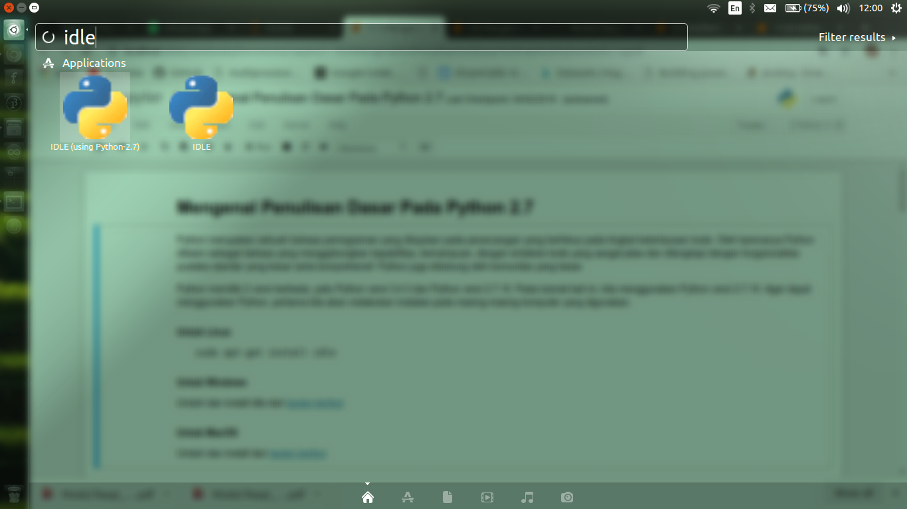

## + Tampilan awal IDLE

Pada awal Idle dibuka, Anda akan melihat sebuah jendela dengan judul `Pyhton 2.7 Shell`. 
Jendela ini merupakan jendela perintah (console) dari Idle tersebut. 
Fungsinya adalah menjalankan perintah-perintah python diluar code python utama atau untuk memasukkan masukan data untuk diolah lagi pada code utama.

Apabila Anda langsung melakukan operasi pada console tersebut, console akan langsung memberikan keluaran dari masukan yang Anda berikan, semisal pada gambar berikut.


## + Bermain menggunakan console Pyhton

Tanda `>>>` merupakan masukan console dalam keadaan standby dan siap untuk diberikan perintah.

Apabila Anda menekan ` Enter ` beberapa kali, maka console tidak memberikan nilai balikan.

+ ### Bagaimana jika kita memasukkan sebuah angka?

Semisal masukkan angka sesuai dengan tanggal pada hari ini. Semisal `16042019` berikut variasinya. Maka tampilan balikan dari console python tersebut seperti gambar berikut ini. 

Untuk penggunaan angka desimal, pada Python, ditandai menggunakan tanda titik ` . ` bukan koma ` , `.


## + Menggunakan Python sebagai kalkulator (alat hitung)

Coba masukkan operasi sederhana pada console Python yang ada, semisal :

```python
15 + 6

70 - 43

14 * 3

13 / 3

13. / 3.
```

Untuk hasil dari perhitungan sederhana diatas, lebih kurang akan menghasilkan operasi seperti gambar berikut


<b>*) </b>Agar penulisan kode lebih mudah terbaca, biasanya diberikan `[spasi]` sebelum dan sesudah operator. Seperti format berikut:
```
Angka [spasi] [operator] [spasi] Angka

```


## + Komentar pada Pyhton

Penggunaan kometar pada Python diawali dengan tanda tagar ` # ` dengan di lanjutkan dengan isi pesan komentarnya atau sekedar untuk mengabaikan kode yang tidak digunakan pada program. 

Contoh: 

```python
#Ini adalah contoh komentar pada Python

5 + 4 #Proses penambahan 5 dan 4
```

Untuk hasil penulisan diatas akan menghasilkan keluaran seperti gambar dibawah ini


## + Variabel

Variabel dalam Python merupakan sebuah tempat atau wadah yang di dalamnya dapat diisikan sebuah nilai atau digantikan dengan nilai yang terbaru. Sifat wadah ini tidak konstan atau dapat berubah.

Contoh penulisan variabel pada Python sebagai berikut:

```python
a = 12
b = 9

c = a + b
```


Pada ` a = 12 ` , nilai `12` dimasukkan pada wadah yang akan disebut dengan `a`. Begitu pula pada ` b = 9 ` , nilai `9` dimasukkan pada wadah yang akan disebut dengan `b`. Sehingga pada wadah ` c `, berisikan operasi pertambahan antara variabel ` a + b `.

<b> *) </b>Untuk menampilkan isi dari variabel pada console, dapat dituliskan nama variabel tersebut pada masukan console.


+ ### Merubah isi variabel

Untuk merubah isi dari variabel yang sudah ada sebelumnya, kita dapat mengubahnya dengan memasukkan nilai  terbaru dari variabel yang sama. Semisal kita akan merubah variabel `a` dengan nilai `15`, maka kurang lebih penulisannya seperti  berikut ` a = 15 `

Untuk hasil ` a + b ` setelah variabel `a` diperbarui menjadi `24` seperti gambar dibawah ini.


+ ### Operasi dengan variabel itu sendiri

Pada operasi ini, sebuah variabel akan dioperasikan dengan variabel yang sama hanya saja berbeda pada posisi  urutan eksekusi pada iterasi. Semisal pada kode berikut:

```python

a = 10
a = a + 5

```


atau dengan menggunakan `+=`, `-=`, `*=`, dan `/=`. 

```python
a = 10   #Inisialisasi variabel a

a += 3   # a = a + 3
a -= 4   # a = a - 4
a *= 5   # a = a * 5
a /= 6   # a = a / 6

```


+ ### Variabel dalam string / kata

Pada penulisan variabel, tidak hanya dapat diisikan dengan angka, pun bisa dalam bentuk string atau kata. Semisal: 

``` python
a = 'Saya' 
b = 'Belajar'
c = 'Python' 

a + b + c
```


Untuk variasi penulisan lainnya:

```python
a *= 3
a += 'Semangat'
a + b + c

```
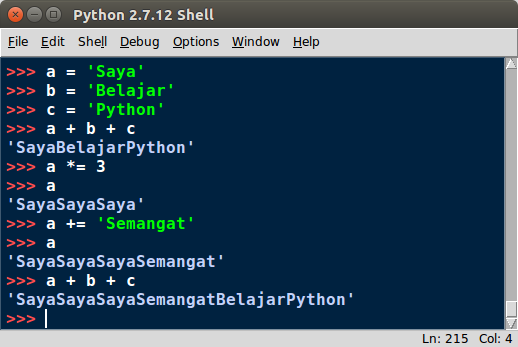

+ ### Penulisan variabel yang baik dan buruk

Untuk penulisan variabel, sebaiknya dalam format huruf kecil semua (lowercase). Ketika terdiri dari dua buah kata, sebaiknya diberi underscore `_` sebagai penghubung keduanya. 

Untuk penulisan variabel yang baik seperti berikut ini:

```python
panjang_bangunan = 100
lebar_bangunan = 50
luas = panjang_bangunan * lebar_bangunan
```

Contoh yang buruk:

```python
panjangBangunan = 1000   # Sulit terbaca
LebarBangunan = 50       # Aneh juga dalam pembacaannya
Luas =  1000 * 50        # Huruf besar pada awal variabel, biasanya digunakan pada sistem Python
x = 'Luas Keduanya'      # Variabel x sering digunakan untuk koordinat


```

+ ### Nilai Boolean

Nilai Boolean merupakan nilai yang berisikan dua tipe, yaitu  `True` dan `False`. Pada Python dan kebanyakan bahasa pemograman lainnya, tanda `=` berarti memasukkan nilai kepada variabel dan tanda `==` merupakan operator pembanding atau kondisi. `a = 3` merupakan `a` diisikan nilai `3`, sedangkan  `a == 3` merupakan kondisi "Apakah `a` berisikan `3` ?", oleh karenannya, nilai balikannya adalah `True` atau `False`. Coba kode berikut ini:

```python
a = 3
a == 3
a == 1
```

maka, hasilnya akan seperti berikut.


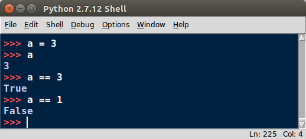

penulisan `a == 3` memiliki fungsi yang sama dengan `(a == 3)`. Akan tetapi, `a == 3` lebih terbaca daripada `(a == 3)`. Sehingga, pada beberapa kondisi penulisan seperti `== True`.

```python
a = 2
a == 2
(a == 2)
(a == 2) == True
(a == 2) == False
(a == 1) == True
```
maka hasilnya akan seperti berikut.
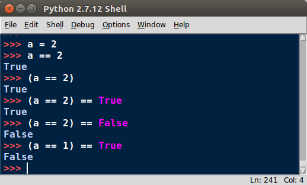


+ ### Penulisan operator pembanding lainnya

Selain penggunaan `==`, ada beberapa operator pembanding lainnya, yaitu:

| Operator  | Deskripsi                         | Contoh untuk `True`   |
|-----------|-----------------------------------|-----------------------|
| `a == b`  | a sama dengan b                   | `1 == 1`              |
| `a != b`  | a tidak sama dengan b             | `1 != 2`              |
| `a > b`   | a lebih besar daripada b          | `2 > 1`               |
| `a >= b`  | a lebih besar atau sama dengan b  | `2 >= 1`, `1 >= 1`    |
| `a < b`   | a kurang dari b                   | `1 < 2`               |
| `a <= b`  | a kurang dari atau sama dengan b  | `1 <= 2`, `1 <= 1`    |


+ ### Nilai None

Nilai `None` merupakan sebuah nilai yang bermakna `Kosong` atau tanpa nilai. Nilai `Kosong` bukan berarti `Nol` atau  `0`. Nilai `None` pada Python lebih kepada `Null` pada bahasa pemograman lainnya. 

Semisal:
```python
b = None      # Beri None pada variabel b
b             # Tampilkan isi dari variabel b

print b       # Print isi dari variabel b

```
maka hasilnya akan seperti berikut.
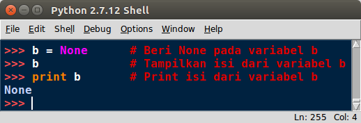

## + Fungsi `print` pada Python

`print` merupakan sebuah fungsi pada Python untuk menampilkan segala jenis hasil operasi ataupun variabel pada layar. Semua jenis data dapat ditampilkan dalam bentuk 'mentah' atau RAW data. Fungsi ini biasanya sangat berguna untuk proses debug ataupun mengetahui proses pengolahan nilai atau operasi pada tiap tahapannya. Fungsi ini sangat berguna pada kode yang lebih banyak nantinya. 

```python
c = 23

print (c)

print (c + 5)

print (c, "lebih kecil dari", c + 7)

print ("Joko Tole \nbersama temannya")

teman = "Jaka Tarub"

print ("Joko Tole \nbersama temannya\n" + teman)
```
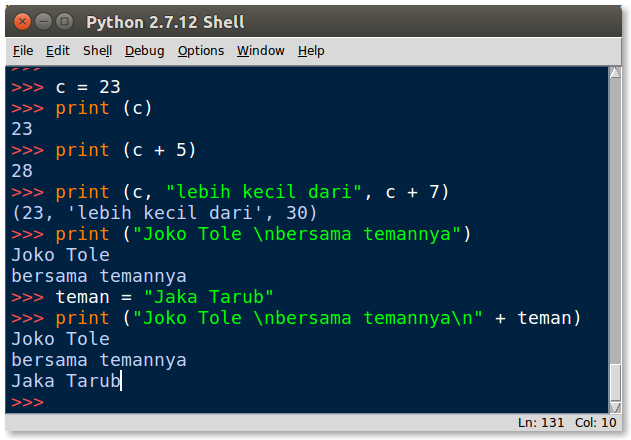


---


# 3. Editor Pada IDLE

Editor pada IDLE berbeda dengan consolenya. Editor ini merupakan sebuah jendela dokumen untuk menuliskan dan memodifikasi kode python kita. Dokumen ini nantinya akan disimpan menjadi format `[ *.py ]`

Untuk membuat sebuah dokumen Python baru, Anda dapat menekan tombol `Ctrl+N` pada keyboard atau klik `File > New File ` pada jendela Python Shell, setelah itu Anda akan diperlihatkan jendela editor kode. Pada jendela ini nantinya kode Python akan ditulilskan. Gambar berikut adalah perbedaan antara jendela console dengan jendela editor Python.

Untuk menyimpan dokumen tersebut, Anda dapat menekan tombol `Ctrl + S` pada keyboard atau `File > Save` pada jendela editor. Pada gambar berikut, dokumen baru yang telah dibuat, disimpan dengan nama `DokumenBaru.py`.
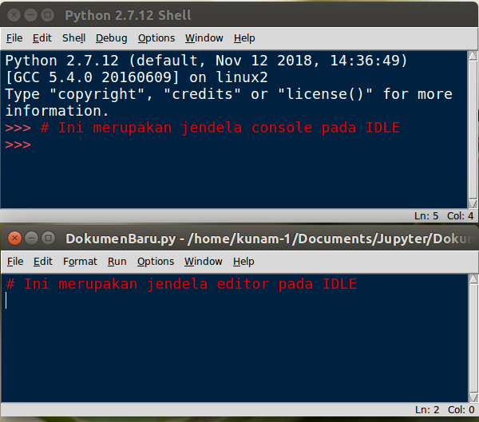

## + Menjalankan program dari editor

Menjalankan program Python yang sudah ditulis pada editor, dapat menekan tombol `F5` pada keyboard atau klik `Run > Run Module` pada menu bar editor IDLE. 

Semisal kita akan menjalankan sebuah program untuk memasukkan sandi yang sederhana menggunakan fungsi `if - else` berikut ini. 

```python
print("Halo Bro!")

nama = raw_input("Namamu siapa? :")
print ("Halo " + nama + '!')

password = input("Masukkan angka sandinya... : ")
if password == 1234:
    print("Sandi benar! \nSelamat datang " + nama + " di program ini.")
else:
    print(nama + ", sandinya salah. \nAkses ditolak!")

```

Maka program Python yang telah dijalankan akan meminta masukan nama user dan password kepada user. Apabila password benar yaitu `1234`, maka program akan memberikan balikan berupa kalimat `Sandi benar! Selamat Datang...`. Sebaliknya, apabila masukan password selain `1234`, maka akan memberikan balikan berupa kalimat `Sandi salah! Akses ditolak!`.
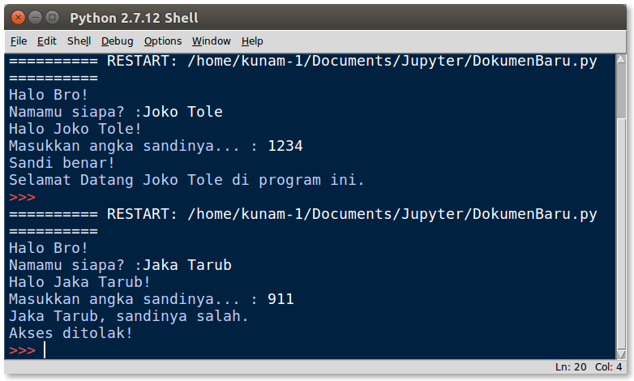

## + Beberapa fitur pada editor IDLE

Beberapa fitur pada editor IDLE yang perlu diketahui adalah:

+ ### Nomor Garis (Line Number)

Pada umumnya, ketika terjadi sebuah kesalahan pada penulisan kode di editor, semisal variabel yang digunakan belum terdeklarasi sebelumnya atau nama variabel berbeda dengan yang digunakan, maka console akan memberitahukan letak baris terjadinya eror seperti pada gambar berikut.

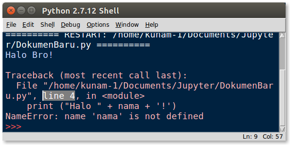


Untuk memastikan letak eror tersebut, biasanya baris kelasahannya berada pada baris sebelumnya dari terjadinya eror. Semisal error pada gambar diatas disebabkan pada `Line 4` karena variabel `nama` pada baris 4 belum terdeklarasi, oleh karenanya error disebabkan pada `baris ke 3` yaitu terletak sebelum error terjadi. Untuk mengetahui `posisi kursor` pada editor berada pada baris ke-berapa, dapat dilihat pada bagian pojok kanan bawah editor IDLE, pada tulisan `ln:[] ` ` col:[]`. Sebagai contoh pada gambar dibawah ini, menunjukkan letak `ln: 3` dan `col:1` pada editor IDLE. 


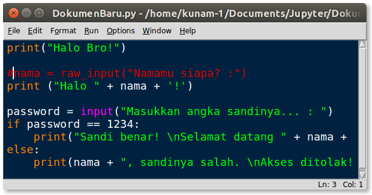


+ ### Kehilangan pasangan pada penulisan (Missing Charracter)

Galat atau error yang sering terjadi pada penulisan kode di Python, adalah kehilangan pasangan pada penulisannya. Semilsal yang sering terjadi adalah 

1. Pasangan tanda kurung `( )`, tanda petik atas `' '` atau `" "`.
2. Penulisan `:` pada perulangan atau pengkondisian
3. Kekurangan `spasi` pada penulisan variabel
4. Penulisan yang kurang sejajar terutama pada perulangan dan pengkondisian

Semisal pada contoh berikut ini:

#### Kekurangan tutup kurung

```python
print("Halo Bro!")

nama = raw_input("Namamu siapa? :" #) #ini posisi kekurangan tutup kurung )
print ("Halo " + nama + '!')
```


#### Kekurangan titik dua

```python
print("Halo Bro!")

nama = raw_input("Namamu siapa? :") 
print ("Halo " + nama + '!')

password = input("Masukkan angka sandinya... : ")
if password == 1234 #:  # ini posisi kekurangan titik dua :
    print("Sandi benar! \nSelamat datang " + nama + " di program ini.")
else:
    print(nama + ", sandinya salah. \nAkses ditolak!")
```
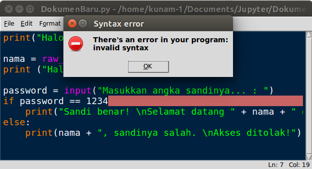

#### Kelebihan spasi

```python
print("Halo Bro!")

nama = raw_input("Namamu siapa? :") 
print ("Halo " + nama + '!')

passwor d = input("Masukkan angka sandinya... : ") # letak kelebihan spasi
if password == 1234:
    print("Sandi benar! \nSelamat datang " + nama + " di program ini.")
else:
    print(nama + ", sandinya salah. \nAkses ditolak!")
```
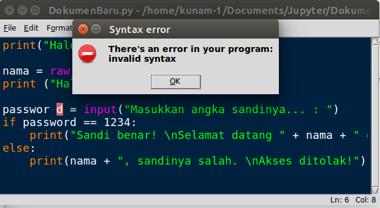

#### Penulisan kurang sejajar secara tingkatannya

```python
print("Halo Bro!")

nama = raw_input("Namamu siapa? :") 
print ("Halo " + nama + '!')

password = input("Masukkan angka sandinya... : ")
if password == 1234:
    print("Sandi benar! \nSelamat datang " + nama + " di program ini.")
  else:  # letak kurang sejajar. Seharusnya lurus dengan tingkatan if nya
    print(nama + ", sandinya salah. \nAkses ditolak!")
```
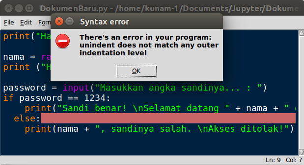


Pada umumnya, ketika terjadi sebuah kesalahan pada penulisan kode di editor, semisal kekurangan tanda titik dua `:`, tutup kurung `)` ataupun kekurangan `spasi`, console IDLE akan memberitahukan letak baris dan kolom terjadinya error 
atau galat yang terjadi.


<b>Pada editor Python, semisal IDLE</b>


Untuk menggunakan komentar pada jumlah yang banyak atau berbaris-baris, dapat digunakan tanda petik atas sebanyak tiga kali <b> [ ''' ]</b> pada perawalan atas komentar dan pada akhiran komentarnya. 

Contoh:


```python
'''
Ini adalah 
komentar dalam jumlah 
berbaris-baris

Komentar ini tidak dieksekusi, kecuali setelah tanda komentar penutup pada akhiran komentar.
'''

4 + 5 #Penambahan antara 4 dan 5
```


    9


---

## Penulisan Pada Python 2.7

Struktur penulisan pada Python, pada umumnya diawali dengan inisialisasi compiler dengan menambahkan kode berikut. 


```python
#!/usr/bin/env python
```

Biasanya penggunaan inisialisasi ini digunakan ketika program python dirunning menggunakan Terminal. Namun dapat diabaikan apabila running program Python menggunakan IDLE. 


---
Author : [yogidm](https://github.com/yogidm)

Merujuk dari [Akuli](https://github.com/Akuli/python-tutorial)

@April 2019

---

